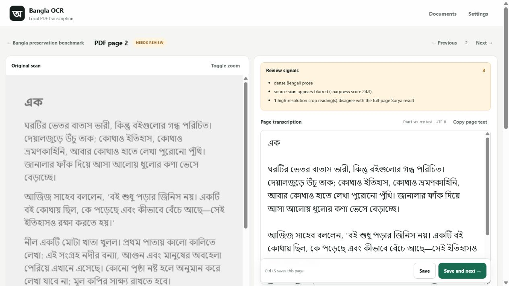

# Bangla OCR


Faithful, local-first Bengali PDF transcription for scanned books and
documents. Bangla OCR keeps the scan as the authority: OCR creates a draft,
automated checks find risk, and a human decides every correction before a
verified export is allowed.



## Why I made this

I grew up loving *Tin Goyenda*, and that childhood connection made the books
and Rokib Hasan's work deeply important to me. The project began as a private
attempt to preserve those books faithfully when I found that many surviving
digital copies were incomplete, poorly scanned, photographed at odd angles, or
difficult to read. The goal was never to modernize or rewrite them—only to keep
the original words, paragraphing, dialogue, and structure intact.

Once the preservation workflow began working, it felt wrong to keep the tool
limited to one series. Many Bengali books face the same problem. Bangla OCR is
therefore being released as a general preservation tool so other readers and
archivists can recover text from aging Bengali scans while retaining human
control over the result.

## What makes it different

- **Scan-faithful by design.** No dictionary or generative model silently
  changes the text.
- **Surya full-page OCR.** Surya is the primary Bengali recognition engine;
  EasyOCR is an explicit recovery option, never a silent fallback.
- **High-resolution crop rereads.** Suspicious or small regions are rendered at
  400 DPI, reread in bounded mode, and shown as alternatives.
- **Evidence beside every decision.** The original page, processed image,
  engine output, crop evidence, revision history, and review state remain in
  the document workspace.
- **Human-gated export.** Verified Markdown and text stay locked until every
  included page is checked and the whole-document audit passes.
- **Local by default.** PDFs and OCR stay on the machine. An optional
  OpenRouter page suggestion sends data only after the user explicitly asks.

## Measured accuracy

The included benchmark uses 20 real pages selected across Volume 002-1. It
contains varied book layouts, dense prose and dialogue, a chapter opening,
degraded/noisy scans, page fragments, and a sparse final page. There is no
embedded PDF text and no generated source prose.

| Metric | Automatic Surya result |
|---|---:|
| Character error rate (CER) | **1.452%** |
| Character accuracy | **98.548%** |
| Word error rate (WER) | **5.732%** |
| Exact pages before review | **0 / 20** |
| Reference characters | **36,237** |
| Processing time | **464.0 s** |

These numbers are the uncorrected Surya output. They deliberately do not count
pending crop alternatives or human fixes as automatic accuracy. The real
20-page PDF, reference transcriptions, and source-page mapping are reviewable
in the repository. See
[the full methodology and per-page results](benchmarks/RESULTS.md).

## Quick start on Windows

Requirements:

- Windows 10 or 11, x64
- Python 3.12 with the `py` launcher
- NVIDIA GPU recommended; CPU mode works but is substantially slower
- About 4–6 GiB free for the CUDA environment, runtime, and first model cache,
  plus space for document workspaces

```powershell
# Clone or download this repository, then open PowerShell in its folder.
.\setup.ps1 -WithSurya -Runtime Auto
.\bangla-ocr.ps1 doctor
.\bangla-ocr.ps1 app
```

Or double-click `Install Bangla OCR.cmd`, then `Start Bangla OCR.cmd`. The
interface opens only on <http://127.0.0.1:8765> by default.

For a smaller CPU-only runtime:

```powershell
.\setup.ps1 -WithSurya -Runtime Cpu
```

The pinned llama.cpp runtime is downloaded from the official release and
verified with SHA-256 before installation. See [INSTALL.md](INSTALL.md) for the
complete clean-install, update, storage, and troubleshooting guide.

## Preservation workflow

```text
PDF import
  -> page render and conservative preprocessing
  -> full-page Surya OCR
  -> structural and text-risk checks
  -> selected 400-DPI crop rereads
  -> side-by-side human review
  -> whole-document audit
  -> verified Markdown / plain text
```

Preprocessing is selected per page. Deskewing and border removal are bounded;
there is no universal destructive crop. The unchanged source render is retained
for review and for mapping every high-resolution crop back to the original.

## Hardware tested

| Component | Release validation system |
|---|---|
| OS | Windows 11 Pro, build 26200 |
| CPU | Intel Core i5-13420H, 8 cores / 12 threads |
| RAM | 7.7 GiB usable |
| GPU | NVIDIA RTX 4050 Laptop GPU, 6 GiB VRAM |
| Driver | NVIDIA 560.94 |
| OCR | Surya 0.22.1 |
| Inference | llama.cpp b10107 (`c0bc8591e`) |

The real 20-page CUDA benchmark completed in 464 seconds, or 23.2 seconds per
page on average, including the crop pass and first-use overhead. Runtime varies
with scan condition, selected regions, thermals, and model cache state.

## Important warnings

- This is a **public beta**, not an automatic archival authority. Always review
  the complete page against the scan.
- Do not expose the web interface to the public internet. It has no user
  authentication, TLS, or multi-tenant isolation.
- The code is Apache-2.0, but Surya's model weights have a separate modified
  OpenRAIL-M license with commercial-use conditions. Read
  [THIRD_PARTY_NOTICES.md](THIRD_PARTY_NOTICES.md).
- Surya 0.22.1 currently declares an old Pillow constraint. This project uses a
  tested Pillow 12.3 security compatibility override; details are in
  [SECURITY.md](SECURITY.md).
- Only process documents you have the right to copy and transcribe.

## Development

```powershell
.\.venv\Scripts\python.exe -m pytest -q
.\.venv\Scripts\python.exe -m build
.\.venv\Scripts\python.exe benchmarks\score_workspace.py <workspace>
```

The repository excludes PDFs supplied by users, OCR outputs, models, runtime
binaries, virtual environments, API keys, and local configuration. The sole
committed PDF is the authorized 20-page real-scan benchmark excerpt described
in [`benchmarks/fixture/NOTICE.md`](benchmarks/fixture/NOTICE.md).

Read [PIPELINE.md](PIPELINE.md) for the architecture,
[transcription-rules.md](transcription-rules.md) for the fidelity contract,
[SECURITY.md](SECURITY.md) for the threat model, and
[CONTRIBUTING.md](CONTRIBUTING.md) before proposing changes.

## License

Bangla OCR source code is licensed under Apache-2.0. Third-party libraries,
binaries, and model weights retain their own licenses.
