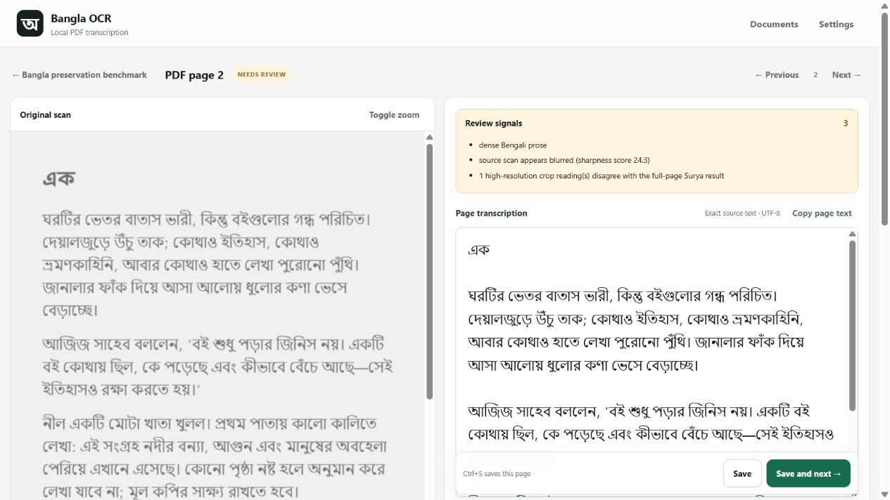

# Bangla OCR


Bangla OCR is a Bengali OCR application for converting scanned Bangla PDFs
and book pages into editable text. It uses Surya OCR, keeps the original scan
beside the result, and gives you a page-by-page review screen before export.



## Why I made this

I grew up reading *Tin Goyenda*, and Rokib Hasan's books were a big part of my
childhood. Many of the PDFs available today are rough scans, photographed
pages, or copies that are difficult to read. I wanted a practical way to
preserve the text without changing the original writing, dialogue, spelling,
or paragraph structure.

While working on *Tin Goyenda*, I realised the same tool could help preserve
many other Bengali books and documents. That is why I decided to make Bangla
OCR public instead of keeping it tied to one series.

## What it does

- Converts scanned Bengali PDFs into editable text.
- Uses Surya as the main OCR engine.
- Shows the scan and OCR result side by side.
- Saves progress so interrupted books can be resumed.
- Exports reviewed books as Markdown or plain text.
- Offers EasyOCR as a manual fallback when Surya cannot continue.
- Detects installed CPU, CUDA, and Vulkan runtimes and explains why an
  unavailable runtime was rejected.
- Verifies an automatic runtime with the first real page and safely tries the
  next Surya runtime only when zero pages have completed.
- Lets you verify actual Surya model startup before processing a book.
- Keeps document processing on your computer by default.

An optional OpenRouter tool can suggest a correction for one review page. It
never changes the document automatically.

## Accuracy on a real scanned book

The included benchmark uses 20 real pages from a scanned Bengali book. Human
corrections and crop suggestions were not counted as automatic OCR accuracy.

| Result | Surya OCR |
|---|---:|
| Character accuracy | **98.548%** |
| Character error rate | **1.452%** |
| Word error rate | **5.732%** |
| Average time on RTX 4050 | **23.2 seconds per page** |

These numbers describe one book and one computer, not every Bengali scan. See
[the benchmark results](benchmarks/RESULTS.md) for the selected pages,
hardware, method, and limitations.

## Install on Windows

Download an installer from the
[GitHub Releases page](https://github.com/siyam-exe/bangla-ocr/releases):

| Download | What it does | Tradeoff |
|---|---|---|
| `Bangla-OCR-1.1.0-windows-x64-universal-setup.exe` | Detects the computer and recommends CPU, NVIDIA CUDA, or experimental Vulkan | Includes CPU as a safe fallback, so the download is larger |

The installer includes its own Python 3.12 runtime. It does not change your
system Python, require PowerShell, or add anything to PATH. Setup lets you
choose the installation folder, including during an upgrade. Open Bangla OCR
from the Start Menu after installation. A small launcher shows real startup
progress and gives you a button to open the local workspace in your browser.

The universal installer contains CPU, CUDA, and Vulkan runtimes. Setup detects
the computer's display adapters, explains its choice, and preselects CPU plus
CUDA for NVIDIA, CPU plus experimental Vulkan for AMD or Intel, or CPU alone
when no supported GPU is found. CPU is always included. You can change the
optional GPU runtimes before installation.

The first OCR run downloads Surya model files, so allow additional disk space
and keep the internet connection active. GPU acceleration speeds up Surya
inference; PDF rendering and image preprocessing still use the CPU.

If you do not want to install it, download the portable ZIP, extract the whole
folder, and run `Bangla OCR.exe`. Do not run the EXE from inside the ZIP.

Windows may show a SmartScreen warning because the beta installer is not code
signed. Verify the SHA-256 value published with the release before running it.

Developers can still install from source:

```powershell
.\setup.ps1 -WithSurya -Runtime Auto
.\bangla-ocr.ps1 doctor
.\bangla-ocr.ps1 launcher
```

`Runtime Auto` installs all three pinned runtimes so the application can choose
after probing the actual computer. Use `-Runtime Cpu`, `-Runtime Cuda`, or
`-Runtime Vulkan` when only one runtime is needed.

The `doctor` command reports Windows display adapters and independently asks
each installed Surya runtime which devices it can use. A detected adapter is
inventory only; the runtime must report a usable device before it is considered
ready. The Settings screen lets you choose Automatic, CUDA, Vulkan, or CPU,
refresh that report, and run a stronger model startup check.

Read [INSTALL.md](INSTALL.md) for system requirements, data locations,
uninstall behavior, source setup, and troubleshooting.

## How a book is processed

```text
Import PDF
  -> render and inspect each page
  -> apply a small deskew or contrast adjustment only when needed
  -> run full-page Surya OCR
  -> review the scan and text side by side
  -> check the complete document
  -> export Markdown or plain text
```

The software does not silently apply dictionary corrections or AI rewrites.
The scan remains the authority during review.

## Things to know

- Bangla OCR is a public beta. Review the text against the scan before treating
  it as complete.
- The local web interface has no login system. Do not expose it directly to the
  public internet.
- Surya model weights use their own license. See
  [THIRD_PARTY_NOTICES.md](THIRD_PARTY_NOTICES.md).
- Only process documents you have permission to copy or transcribe.

## Project documents

- [Installation and troubleshooting](INSTALL.md)
- [Pipeline design](PIPELINE.md)
- [Transcription rules](transcription-rules.md)
- [Security notes](SECURITY.md)
- [Benchmark method and results](benchmarks/RESULTS.md)
- [Release acceptance](docs/RELEASE_ACCEPTANCE.md)
- [Contributing](CONTRIBUTING.md)

## Development

```powershell
.\.venv\Scripts\python.exe -m pytest -q
.\.venv\Scripts\python.exe -m build
```

## License

The Bangla OCR source code is licensed under Apache-2.0. Libraries, binaries,
and model weights keep their original licenses.
